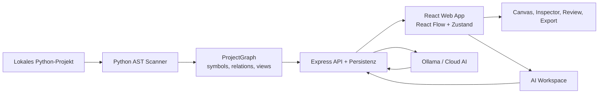

# DMPG UML Editor


Interaktiver UML- und Architektur-Editor fuer lokale Python-Projekte.  
Das Tool scannt Quellcode, baut daraus einen mehrstufigen Graphen, visualisiert ihn in React Flow, speichert mehrere Projekte persistent und ergaenzt den Graph optional mit KI-gestuetzten Reviews, Dokumentation und referenzgetriebenem UML-Autorefactor.

## Inhalt

- [Was das Projekt macht](#was-das-projekt-macht)
- [Wie das System funktioniert](#wie-das-system-funktioniert)
- [Monorepo-Struktur](#monorepo-struktur)
- [Features](#features)
- [Setup und Entwicklung](#setup-und-entwicklung)
- [Konfiguration](#konfiguration)
- [Projekt-Workflow](#projekt-workflow)
- [API-Ueberblick](#api-ueberblick)
- [Daten und Persistenz](#daten-und-persistenz)
- [Wichtige Hinweise](#wichtige-hinweise)

## Was das Projekt macht

DMPG UML ist kein reiner Diagramm-Maler, sondern eine Scan-, Review- und Bearbeitungsumgebung fuer Code-basierte UML-/Architekturansichten.

Konkret:

- scannt ein lokales Python-Projekt per AST-Scanner
- erzeugt `symbols`, `relations` und `views` als gemeinsamen Projektgraph
- baut automatisch eine View-Hierarchie `Root -> Group -> Module -> Class`
- visualisiert alles in einer bearbeitbaren React-Flow-Canvas
- speichert mehrere gescannte Projekte parallel und kann zwischen ihnen umschalten
- unterstuetzt AI-Dokumentation, Struktur-Review, Label-Review, Kontext-Review und Referenzbild-Vergleiche
- kann sichere UML-Aenderungen automatisch anwenden und per Snapshot rueckgaengig machen

## Wie das System funktioniert



Der technische Ablauf beim Scan:

1. Der Server ruft `apps/server/src/scanner/python_scanner.py` auf.
2. Der Raw-Scan wird in einen `ProjectGraph` ueberfuehrt.
3. Symbole werden entweder per `dmpg-uml.config.json` gruppiert oder aus der Ordnerstruktur abgeleitet.
4. Zusaetzlich werden uebergeordnete Domain-Layer eingefuegt.
5. Daraus entstehen Views fuer Root-, Group-, Module- und Class-Ebene.
6. Externe Artefakte koennen zu Cluster-/Kategoriegruppen zusammengefasst werden.
7. Der Graph wird persistent gespeichert und im Frontend sofort angezeigt.

## Monorepo-Struktur

| Pfad | Zweck |
| --- | --- |
| `apps/server/` | Express-Backend, Scanner, Graph-Store, AI-Routen |
| `apps/web/` | React-Frontend mit React Flow, Sidebar, Inspector, Review-UI |
| `packages/shared/` | Zod-Schemas, gemeinsame Typen, Projektionen |
| `docs/` | Fachliche und technische Zusatzdokumentation |
| `demo_data/data_pipeline/` | Read-only Demo-/Scan-Kontext |
| `demo_data/dmpg_models/` | Read-only Demo-/Scan-Kontext |
| `output/` | Export-/Artefakt-Ausgaben waehrend Entwicklung |

## Features

### Scan und Graph-Modell

- Python-Projekt-Scan ueber AST
- Symbol-Klassen: `package`, `module`, `class`, `function`, `method`, `script`, `constant`, `external`, `group`, `interface`, `variable`
- Relations-Typen: `imports`, `contains`, `calls`, `reads`, `writes`, `inherits`, `uses_config`, `instantiates`, `association`, `aggregation`, `composition`
- Optionale Scanner-Konfiguration ueber `dmpg-uml.config.json`
- Automatische Domain-Layer und mehrstufige Views
- Coding-Guideline-Metadaten direkt am Symbol

### Frontend

- React Flow Canvas mit Drag, Zoom, Pan und Edge-Handling
- linke Sidebar mit View-Tree, Symbolsuche, Node-Palette, Projektverwaltung und AI Workspace
- rechte Inspector-Ansicht fuer Symbol-Details, Relationen, Seiteneffekte und Source-Zugriff
- Breadcrumb-Navigation und Drilldown in Child-Views
- Projektionstoggle in Nicht-Root-Views: `Overview`, `Klassendiagramm`, `Sequenzdiagramm`
- Demo-Graph beim Erststart, falls noch kein Projekt geladen ist
- Einheitliche Command Palette: `Ctrl+P` fuer Symbolsuche, `Ctrl+Shift+P` fuer Aktionen
- Undo/Redo fuer Graph-Aenderungen
- HTML-Export fuer einzelne Views oder ganze Projekte
- Import/Export von Projektpaketen als `.dmpg-uml.json`

### AI und Review

- Einzel-Symbol-Zusammenfassung und Batch-Summaries
- Projektweite AI-Analyse mit den Phasen:
  - `labels`
  - `docs`
  - `relations`
  - `dead-code`
  - `structure`
- pausierbare / fortsetzbare Analyse mit SSE und Polling-Fallback
- Validate-Mode zum Pruefen von AI-Aenderungen inklusive IDE-Sprung
- AI Workspace fuer die aktuell geoeffnete View
- Struktur-, Kontext- und Label-Review auf View-Ebene
- Vision Review fuer Diagrammbilder
- Referenzbild-Vergleich "aktueller View vs. Zielbild"
- Reference-driven UML Autorefactor mit Undo-Snapshot

## Setup und Entwicklung

### Voraussetzungen

- Node.js `>= 18`
- `pnpm`
- Python 3

### Installation

```bash
pnpm install
```

Hinweis: `pnpm install` baut `@dmpg/shared` automatisch mit.

### Entwicklung starten

Alles parallel:

```bash
pnpm dev
```

Das startet:

- Shared-Compiler im Watch-Modus
- Server auf Port `3001`
- Web-App auf Port `5173`

Einzeln:

```bash
pnpm --filter @dmpg/shared dev
pnpm --filter @dmpg/server dev
pnpm --filter @dmpg/web dev
```

Build:

```bash
pnpm build
```

Typecheck:

```bash
pnpm typecheck
```

Server-Tests:

```bash
pnpm --filter @dmpg/server test
```

## Konfiguration

Die Server-Konfiguration liegt in `apps/server/.env`.

Startpunkt:

```bash
Copy-Item apps/server/.env.example apps/server/.env
```

### Wichtige Basis-Variablen

| Variable | Default | Bedeutung |
| --- | --- | --- |
| `PORT` | `3001` | Express-Port |
| `SCAN_PROJECT_PATH` | leer | Default-Pfad fuer den Scan-Dialog |
| `DMPG_DATA_DIR` | `.dmpg-data` relativ zum Server-CWD | Persistente Projekt- und Snapshot-Daten |
| `AI_PROVIDER` | `cloud` | `cloud` oder `local` |
| `OLLAMA_BASE_URL` | `https://ollama.com` | Cloud-Endpunkt |
| `OLLAMA_LOCAL_URL` | `http://127.0.0.1:11434` | Lokaler Ollama-Endpunkt |
| `OLLAMA_LOCAL_MODEL` | leer | Optionales Legacy-Override fuer lokales Modell |
| `OLLAMA_API_KEY` | leer | API-Key fuer Cloud-Provider |
| `OLLAMA_MODEL` | `llama3.1:8b` | Cloud-/Fallback-Modell fuer `AI_PROVIDER=cloud` |
| `OLLAMA_CLOUD_MODEL` | leer | Cloud-spezifisches Modell |
| `AI_HTTP_JSON_LIMIT` | `50mb` | JSON-Body-Limit, relevant fuer Screenshots/Base64 |
| `DMPG_PROCESS_OVERVIEW_MODE` | leer | `manual`: bevorzugt `process-diagram.json`, sonst Auto-Overlay |
| `DMPG_PROCESS_OVERVIEW_DEBUG_JSON` | leer | `1`: Fallback auf `process-diagram.json`, wenn Auto-Overlay fehlschlaegt |

### AI Model Routing

Wenn `AI_MODEL_ROUTING_ENABLED=false` ist, laeuft alles ueber das globale Modell.

Wenn `AI_MODEL_ROUTING_ENABLED=true` ist, nutzt der Server task-spezifische Modelle:

| Task | Variable |
| --- | --- |
| `general` | `AI_DEFAULT_TASK_MODEL` |
| `code_analysis` | `UML_CODE_ANALYSIS_MODEL` |
| `diagram_review` | `UML_DIAGRAM_REVIEW_MODEL` |
| `vision_review` | `UML_VISION_REVIEW_MODEL` |
| `labeling` | `UML_LABELING_MODEL` |
| `relation_validation` | `UML_RELATION_VALIDATION_MODEL` |

Fallback-Reihenfolge:

1. Task-spezifisches Modell
2. `AI_DEFAULT_TASK_MODEL` bei `general`
3. `UML_FALLBACK_MODEL`
4. globales Modell:
   - local: im AI Workspace ausgewaehltes Modell
   - cloud: `OLLAMA_CLOUD_MODEL` oder `OLLAMA_MODEL`
5. interner Default `llama3.1:8b` fuer Cloud

### Process Overview Overlay (optional)

- Standardverhalten: Auto-Overlay wird aus dem gescannten Graph erzeugt.
- `DMPG_PROCESS_OVERVIEW_MODE=manual`: `process-diagram.json` wird bevorzugt.
- `DMPG_PROCESS_OVERVIEW_DEBUG_JSON=1`: bei Auto-Fehler wird auf `process-diagram.json` zurueckgefallen.

### Minimalbeispiele

Lokaler Ollama-Betrieb:

```env
PORT=3001
SCAN_PROJECT_PATH=C:\dev\dmpg_models\data_pipeline
AI_PROVIDER=local
OLLAMA_LOCAL_URL=http://127.0.0.1:11434
AI_MODEL_ROUTING_ENABLED=false
```

Hinweis: Das lokale Modell wird im AI Workspace oben ueber das Dropdown gewaehlt. Beim Oeffnen wird die Liste jedes Mal mit `ollama ps` aktualisiert.

Cloud-Modus mit Routing:

```env
PORT=3001
AI_PROVIDER=cloud
OLLAMA_BASE_URL=https://ollama.com
OLLAMA_API_KEY=YOUR_TOKEN
OLLAMA_MODEL=qwen3.5:cloud
AI_MODEL_ROUTING_ENABLED=true
UML_FALLBACK_MODEL=qwen3.5:cloud
UML_CODE_ANALYSIS_MODEL=qwen3-coder:480b-cloud
UML_DIAGRAM_REVIEW_MODEL=qwen3.5:cloud
UML_VISION_REVIEW_MODEL=qwen3.5:cloud
UML_LABELING_MODEL=qwen3.5:cloud
UML_RELATION_VALIDATION_MODEL=glm-5
```

### Optionale Scanner-Konfiguration

Wenn ein Projekt eine Datei `dmpg-uml.config.json` enthaelt, kann die Gruppierung explizit gesteuert werden.

Beispiel:

```json
{
  "sections": [
    {
      "id": "io",
      "title": "IO",
      "patterns": ["connector", "loader", "writer"]
    },
    {
      "id": "domain",
      "title": "Domain",
      "patterns": ["model", "entity", "service"]
    },
    {
      "id": "misc",
      "title": "Misc",
      "patterns": [".*"]
    }
  ],
  "autoFallback": true
}
```

Ohne diese Datei gruppiert der Scanner dynamisch ueber die Ordnerstruktur.

## Projekt-Workflow

### 1. Projekt laden

Moeglichkeiten:

- beim ersten Laden wird automatisch ein Demo-Graph erzeugt, wenn noch kein Projekt aktiv ist
- ueber den Projektpfad in der Sidebar scannen
- ueber den Folder-Browser einen Ordner waehlen
- ein exportiertes `.dmpg-uml.json`-Projekt importieren
- zwischen bereits gespeicherten Projekten umschalten

### 2. Im Graph navigieren

- Root-View zeigt die obersten Gruppen / Domain-Layer
- Doppelklick oder Drilldown oeffnet Child-Views
- In Group/Module/Class-Views kann die Darstellung ueber den Projektionstoggle zwischen `Overview`, `Klassendiagramm` und `Sequenzdiagramm` gewechselt werden
- Breadcrumb bringt dich wieder nach oben
- `Ctrl+P` oeffnet die Symbolsuche
- `Ctrl+Shift+P` oeffnet den Aktionsmodus der Command Palette

### 3. Bearbeiten und pruefen

- Nodes koennen auf dem Canvas verschoben werden
- neue UML-Knoten koennen aus der Node-Palette gezogen werden
- Kanten koennen interaktiv verbunden oder geloescht werden
- Inspector zeigt Relationen, Dokumentation, Tags und Seiteneffekte
- Source-Code kann angezeigt oder in der IDE geoeffnet werden

### 4. AI-Projektanalyse

Die projektweite Analyse arbeitet auf dem geladenen Graphen und kann pausiert / fortgesetzt werden.

Phasen:

1. `labels` - unklare Labels bereinigen
2. `docs` - Symbol-Dokumentation generieren
3. `relations` - fehlende Relationen vorschlagen und validieren
4. `dead-code` - Code Hygiene: unerreichbare Bloecke, auskommentierten Code und ungenutzte sichtbare Symbole erfassen
5. `structure` - Gruppenstruktur reviewen, umbenennen, verschieben, mergen oder splitten

Danach kann der Validate-Mode genutzt werden:

- Aenderungen einzeln bestaetigen oder ablehnen
- Kommentare hinterlegen
- in VS Code oder IntelliJ springen
- ueber Keyboard durch die Aenderungen laufen

### 5. AI Workspace auf View-Ebene

Der AI Workspace arbeitet gezielt auf der aktuell geoeffneten View.

Wenn `AI_PROVIDER=local` gesetzt ist:

- zeigt das Provider-Dropdown die aktuell laufenden Modelle aus `ollama ps`
- die Liste wird bei jedem Oeffnen neu geladen
- das ausgewaehlte Modell wird fuer den Lauf verwendet, ohne dass `apps/server/.env` angepasst werden muss
- wenn kein vision-faehiges Modell verfuegbar ist, wird der Referenz-Schritt im Workspace uebersprungen und im UI als Skip angezeigt

Moegliche Schritte:

- Struktur pruefen
- externen Kontext pruefen
- Labels verbessern
- optional Referenzbild hochladen

Wenn ein Referenzbild gesetzt ist:

- wird der aktuelle View automatisch als Bild exportiert
- mit dem Referenzbild verglichen
- ein Refactor-Plan erstellt
- sichere Aenderungen koennen automatisch angewendet werden
- ein Snapshot fuer Undo wird erzeugt

Typische sichere Auto-Apply-Aktionen:

- UML-Typ aendern
- Symbol oder View umbenennen
- Kontext-Stub / Note / Datenbank / Komponente hinzufuegen
- Relation hinzufuegen
- Parent neu zuweisen
- neue View erzeugen
- Layout neu rechnen

Groessere Umbauten wie `split_group`, `merge_group` oder `rebuild_view` bleiben bewusst review-only oder werden uebersprungen.

### 6. Export

Unterstuetzt werden:

- Projektpaket als `.dmpg-uml.json`
- komplette HTML-Projektansicht
- einzelne View als HTML

Der HTML-Export ist bewusst standalone:

- kein Server noetig
- kein AI-Workflow enthalten
- Navigation, Inspector, Suche und Zoom bleiben nutzbar

## API-Ueberblick

### Basis

| Methode | Pfad | Zweck |
| --- | --- | --- |
| `GET` | `/api/health` | Health-Check |
| `GET` | `/api/config` | Frontend-relevante Server-Konfiguration |
| `POST` | `/api/open-in-ide` | Datei in VS Code oder IntelliJ oeffnen |

### Graph und Projekte

| Methode | Pfad | Zweck |
| --- | --- | --- |
| `GET` | `/api/graph` | aktuellen Graph laden, Demo-Graph falls keiner existiert |
| `PUT` | `/api/graph` | kompletten Graph ersetzen |
| `PATCH` | `/api/graph/symbol/:id/doc` | Doku eines Symbols aktualisieren |
| `GET` | `/api/graph/source/:id` | Quellcode-Ausschnitt fuer ein Symbol laden |
| `GET` | `/api/projects` | bekannte Projekte auflisten |
| `POST` | `/api/projects/switch` | aktives Projekt wechseln |
| `DELETE` | `/api/projects` | Projekt aus Index und Persistenz entfernen |

### Scan

| Methode | Pfad | Zweck |
| --- | --- | --- |
| `POST` | `/api/scan` | lokales Projektverzeichnis scannen |
| `GET` | `/api/scan/browse` | Verzeichnisse fuer Folder-Browser durchsuchen |

### AI - Dokumentation und Analyse

| Methode | Pfad | Zweck |
| --- | --- | --- |
| `POST` | `/api/ai/summarize` | Doku fuer ein Symbol generieren |
| `POST` | `/api/ai/batch-summarize` | Doku fuer mehrere Symbole generieren |
| `GET` | `/api/ai/local-models` | laufende lokale Ollama-Modelle via `ollama ps` laden |
| `POST` | `/api/ai/analyze` | projektweite AI-Analyse via SSE starten |
| `GET` | `/api/ai/analyze-status` | Fortschritt pollen |
| `GET` | `/api/ai/analyze-events` | Event-Log fuer Fallback-/Reconnect-Transport |
| `GET` | `/api/ai/analyze-baseline` | Baseline fuer Validate-Mode laden |
| `POST` | `/api/ai/pause` | laufende Analyse pausieren |
| `POST` | `/api/ai/cancel` | laufende Analyse abbrechen |

### AI - UML / View-Review

| Methode | Pfad | Zweck |
| --- | --- | --- |
| `POST` | `/api/ai/uml/enrich-symbol` | fehlende Symbol-Doku ergaenzen |
| `POST` | `/api/ai/uml/enrich-view-symbols` | mehrere Symbole in einer View anreichern |
| `POST` | `/api/ai/uml/suggest-missing-relations` | fehlende Relationen vorschlagen |
| `POST` | `/api/ai/uml/review-view-structure` | Struktur-Review fuer eine View |
| `POST` | `/api/ai/uml/review-external-context` | externe Kontextknoten vorschlagen |
| `POST` | `/api/ai/uml/improve-view-labels` | bessere Labels vorschlagen |
| `POST` | `/api/ai/uml/review-view` | Struktur- und Label-Review kombiniert |
| `GET` | `/api/ai/uml/view-opportunities` | problematische / sparse Views finden |
| `POST` | `/api/ai/uml/workspace-run` | View-Workspace-Run via SSE starten |

### AI - Vision / Referenzvergleich

| Methode | Pfad | Zweck |
| --- | --- | --- |
| `POST` | `/api/ai/vision/review` | Diagrammbild reviewen |
| `POST` | `/api/ai/vision/compare` | zwei Diagrammbilder vergleichen |
| `POST` | `/api/ai/vision/suggestions` | strukturierte Bildverbesserungen erzeugen |
| `POST` | `/api/ai/vision/compare-uml` | aktuellen UML-View mit Referenzbild vergleichen |
| `POST` | `/api/ai/vision/compare-apply` | referenzgetriebenen UML-Autorefactor ausfuehren |
| `POST` | `/api/ai/vision/compare-apply/undo` | letzten Refactor-Snapshot wiederherstellen |

## Daten und Persistenz

Der Server speichert pro Projekt getrennte Daten auf Platte.

Wichtig:

- jedes Projekt bekommt einen Hash-basierten Ordner
- Graphen werden automatisch debounced geschrieben
- AI-Fortschritt wird pro Projekt gespeichert
- Referenz-Autorefactor legt Undo-Snapshots an

Typische Struktur unter `DMPG_DATA_DIR`:

```text
.dmpg-data/
  projects-meta.json
  projects/
    <hash>/
      graph.json
      ai-progress.json
      snapshots/
```

## Wichtige Hinweise

### Demo-Daten sind read-only

Diese Verzeichnisse dienen nur als Beispiel-/Scan-Kontext und sollen nicht veraendert werden:

- `demo_data/data_pipeline/`
- `demo_data/dmpg_models/`

### Scanner-Support

Aktuell scannt das Projekt echte Codebasis nur ueber den Python-Scanner.  
Die UML-/AI-Logik arbeitet zwar auf dem allgemeinen Graph-Modell, der automatische Code-Scan ist aber auf Python ausgelegt.

### IDE-Integration

`/api/open-in-ide` erwartet lokal verfuegbare CLI-Kommandos:

- VS Code: `code`
- IntelliJ: `idea64` oder `idea`

### Weitere Doku

Fachliche und experimentelle Zusatzdokumente liegen unter `docs/`.

